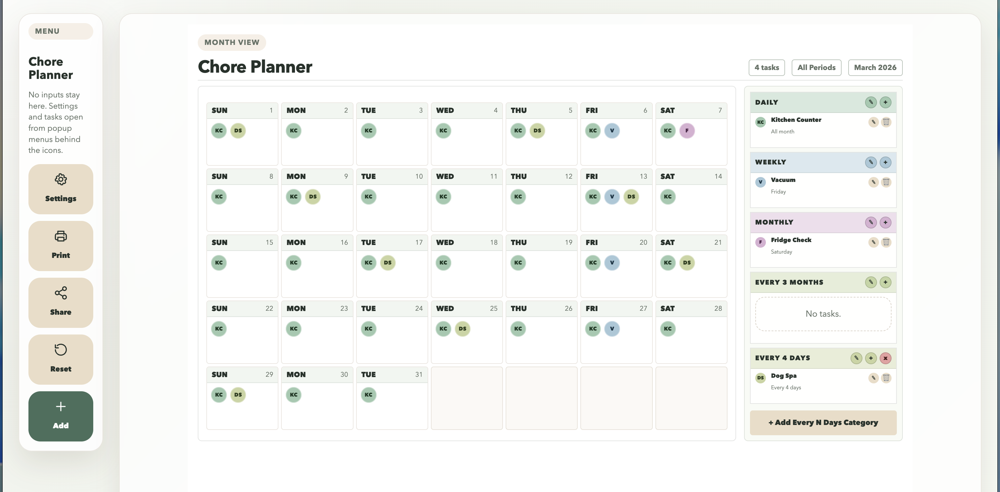

# Chore Family Planner

Printable monthly chore calendar for families. Assign tasks to days, drag & drop to reschedule, and print a clean A4 landscape sheet.

All data stays in your browser (localStorage). No account, no server-side storage.



## Features

- **Monthly calendar view** with daily, weekly, monthly, and quarterly task categories
- **Drag & drop** tasks between days directly on the calendar
- **Color-coded categories** with customizable colors
- **Print-optimized** A4 landscape layout - fits the full page cleanly
- **Share via link** - compressed planner data encoded in the URL, no server needed
- **localStorage persistence** - data survives browser restarts
- **Import protection** - opening a shared link asks before overwriting your existing calendar
- **Multiple people** - configure family members in settings

## Quick Start

### Python (development)

```bash
python -m venv .venv
source .venv/bin/activate
pip install -r requirements.txt
python chore_calendar_app.py
```

Open `http://127.0.0.1:5050`

### Docker (production)

```bash
docker-compose up -d
```

Open `http://localhost:8000`

## Sharing

Click **Share** to copy a link containing your full planner data. Send it to anyone - they open the link and get your calendar loaded in their browser. If they already have their own calendar, they'll be asked whether to replace it or keep theirs.

## Printing

Click **Print** or use `Ctrl+P` / `Cmd+P`. The layout is optimized for A4 landscape with minimal margins. Set browser print scale to 100%.

## Security

The Docker setup includes:

- Read-only filesystem (`read_only: true`)
- Non-root container user with no shell
- All Linux capabilities dropped (`cap_drop: ALL`)
- No privilege escalation (`no-new-privileges`)
- CPU and memory limits (1 CPU, 256MB)
- Security headers: CSP, HSTS, X-Frame-Options, nosniff, Referrer-Policy
- Gunicorn with request size limits and worker recycling

## Stack

- **Backend**: Flask + Gunicorn (serves HTML only, no API)
- **Frontend**: Vanilla JS, no build step
- **Storage**: Browser localStorage
- **Sharing**: lz-string compression to URL parameter
- **Deployment**: Docker with hardened config

## Known Issues

- CSS for print is a nightmare - print layout may need manual scale adjustment in some browsers

## License

MIT
